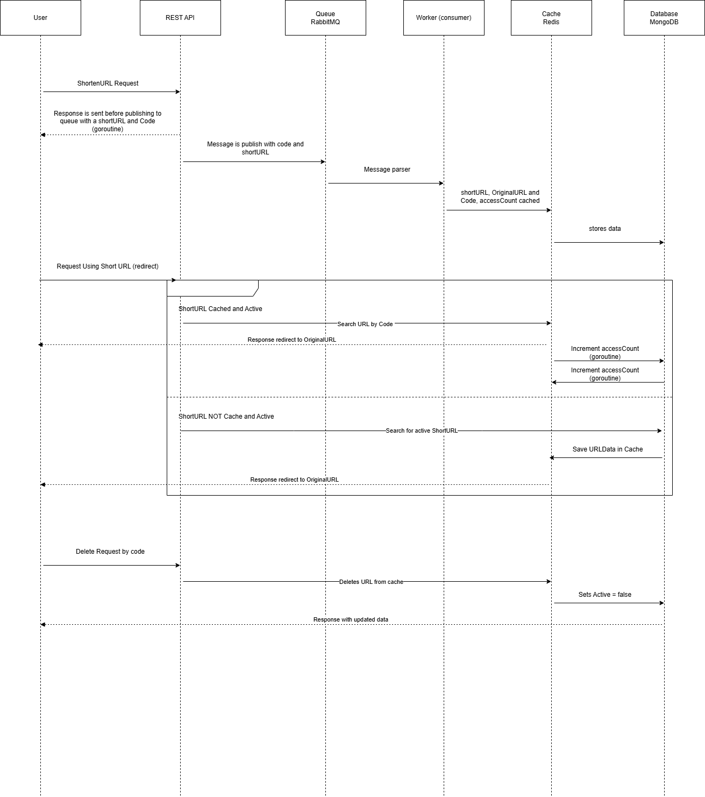

# RFC Desafio MeLi

---

## O Desafio

É proposto que crie-se uma API para encurtar URLs com baixíssima latência e alta escalabilidade, com a finalidade de atender um alto número de requisições por segundo. Além disso, a API deve disponibilizar de um endpoint para apagar uma URL encurtada, bem como cada URL encurtada, ao ser acessada, deve redirecionar o usuário para a URL original.
É desejável que métricas estejam disponíveis para aquela URL.

## Requisitos

- Dada uma URL longa, devolver uma URL curta;
- Obtenção de informações sobre serviços que usam a URL;
- 90% das requisições respondam em menos 10ms (p90 < 10ms);
- Posibilidade de apagar as URLs curtas;
- Ao acessar URL curta, usuário deve ser redirecionado para a URL longa;
- A URL curta deve estar disponível no tempo de 1s;

## Proposta de desenvolvimento

Visando manter a baixa latência mesmo sob alta carga de requisições, o sistema deve escalar horizontalmente, processar assincronamente as requisições sem bloqueio de I/O, conter uma camada de cache para leitura e também conseguir lidar com paralelismo para operações de leitura e escrita.

Visando isso, o que foi desenvolvido até então é um sistema composto por:

- API REST (usando o framework fiber);
- Docker (containers);
- RabbitMQ (fila);
- worker (consumer da fila);
- Redis (cache);
- MongoDB (persistência);

### Interação entre os componentes

#### Encurtamento de URL

Ao encurtar uma URL, a API valida a request e devolve de imediato uma **URL encurtada e o código (URL curta sem domínio)**, delegando a uma **goroutine** a publicação de uma mensagem para o *RabbitMQ*. Em caso de falha da publicação, essa goroutine irá persistir a URL encurtada tanto no *Redis* quanto no *MongoDB*.

Uma vez a mensagem na fila, um **worker** irá consumir a mensagem, com a finalidade de persistir tanto no cache quanto no banco de dados. Em caso de falha, a mensagem não deverá ser removida da fila.

#### Redirecionamento de URL Curta

Ao efetuar a requisição com a URL curta, o serviço irá **buscar no cache** e isso acarretará alguns cenários:

- URL Curta está cacheada
Neste caso, a busca retornará os dados disponíveis no cache e uma goroutine irá atualizar o cache e o banco de dados, aumentando o contador de acessos.

- URL Não está cacheada e está ativa
Neste caso, a busca será feita no banco de dados e caso a URL esteja ativa, seus dados serão cacheados e o contador de acessos será incrementado;

- URL Não está cacheada e está inativa:
Neste caso, a busca é efetuada no banco de dados e por estar inativa, não permite o redirecionamento, devolvendo o status de "not found" para o usuário.

#### Delete de URL Curta

Neste caso, busca-se a URL curta **primeiramente no cache**, e, se encontrada, é feita sua remoção do cache.
Após isso, a URL Curta é procurada no banco de dados e seu **campo "is_active" é atualizado para false**.

#### Busca de Stats de URL Curta

Através do endpoint */stats/:code* é possível **verificar o estado de uma URL**, tais quais "is_active" e "access_count".
A busca segue a ordem padrão de conferir o cache e após isso o banco de dados. Naturalmente, caso uma URL Curta não esteja ativa, ou seu TTL no cache tenha expirado, seus dados estarão disponíveis somente no banco de dados.
Estes dados irão retornar para o usuário.

Abaixo há um diagrama de sequencia para ilustrar essas interações:

## Resultados

### Pontos que foram atingidos

O serviço consegue entregar as URLs curtas e redirecionar, bem como apagar a URL curta (soft delete).
O processamento é feito de forma assíncrona e a resposta fica abaixo de 10 ms.

A forma como foi dividido permite que se escale a aplicação, aumentando o número de containers de API e Worker.

### Pontos que não foram atingidos

#### Resposta p90 < 10ms com burst de requisições

Após efetuar um teste de carga (usando k6), o sistema não entrega o tempo de resposta desejado para as requisições.

#### Observabilidade

Não foi possível adicionar métricas ao projeto, nem tracing para identificar as requests.
O único dado disponível é "access_count", contador de acessos da URL.

### Sugestões de melhoria

Para que seja possível efetuar tracing das requests da aplicação, e ter visualição de métricas, sugiro a utilização de:

- OpenTelemetry, forncendo a instrumentação para as métricas;
- Jaeger, para a visualização das métricas e tracings;

Para atacar o ponto da latência das requisições em situações de alta carga, pode-se adotar algumas medidas:

- Uso de um Load Balancer
- Uso do Kubernetes para auto-scaling dos containers de API e Workers
- Otimização das configurações de Sharding e ReadReplicas do MongoDB
- Mudança de protocolo para gRPC ou Protobuff